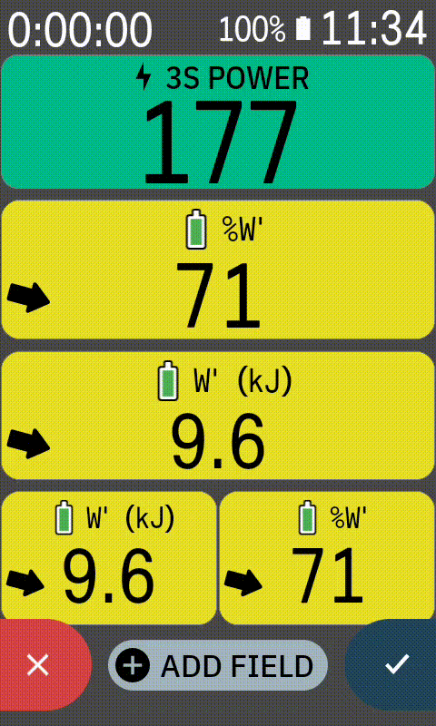
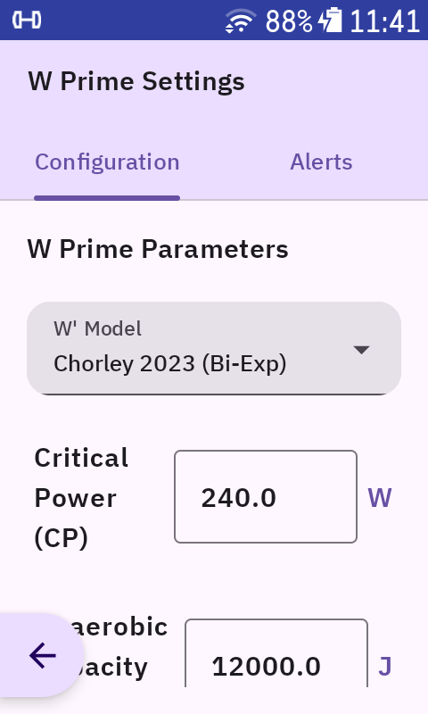
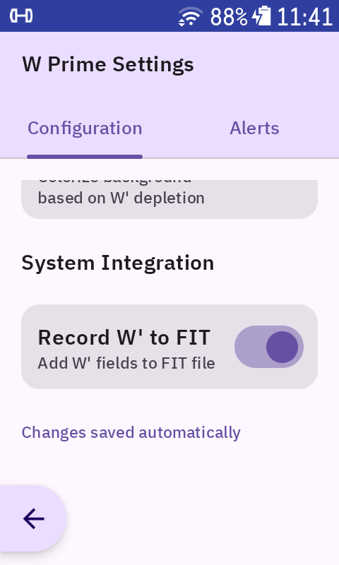
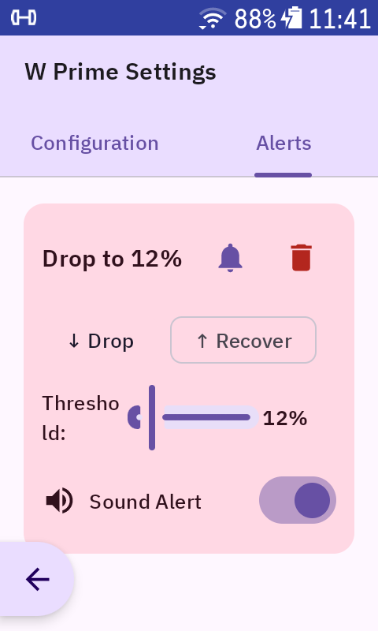
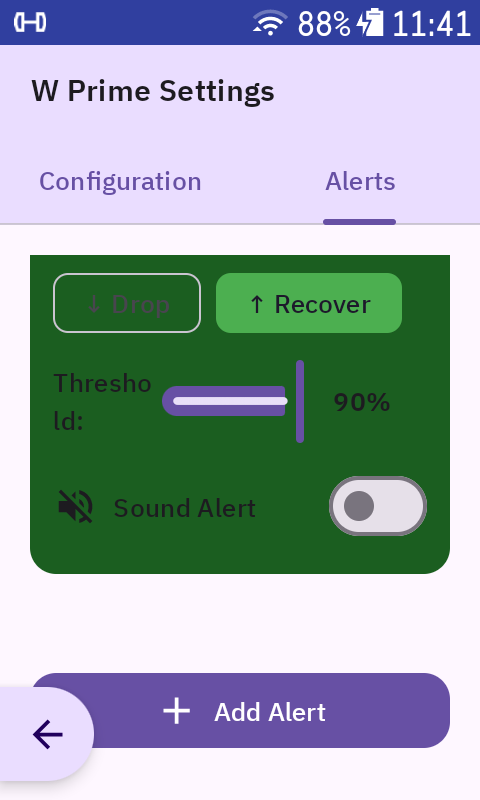
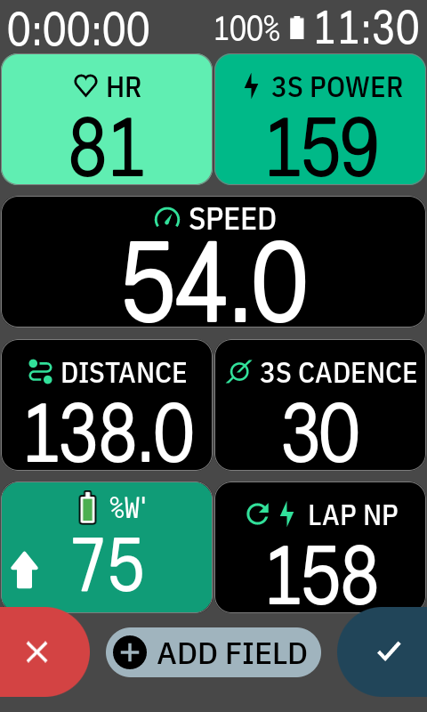
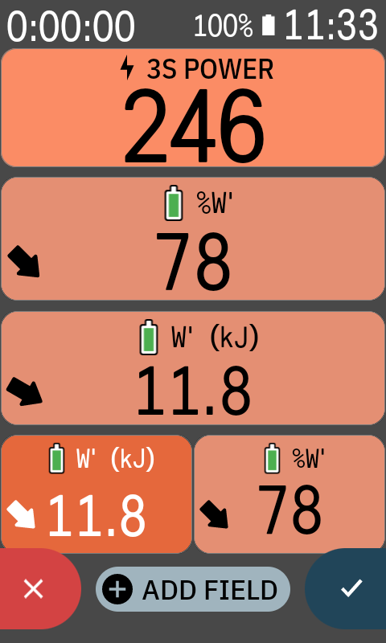
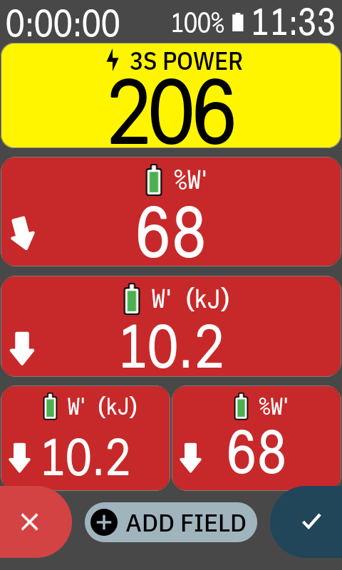
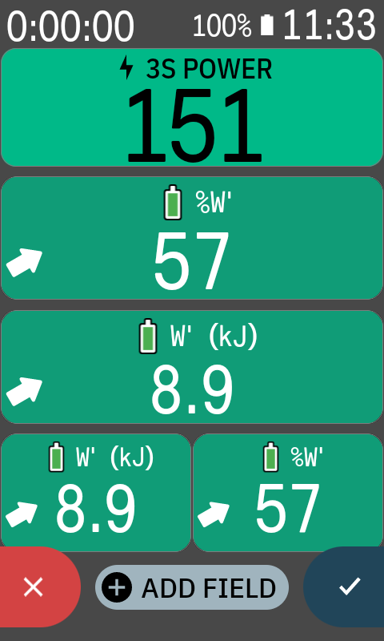
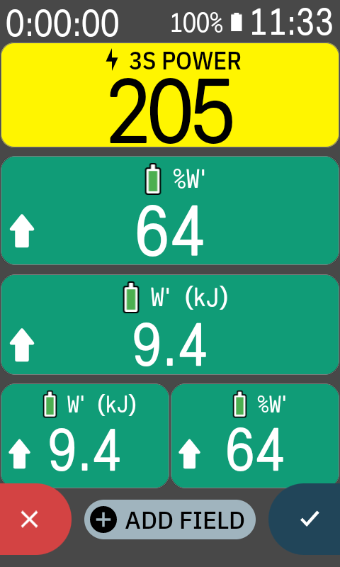

# W Prime Extension for Hammerhead Karoo 3

[](https://github.com/apopovsky/WPrimeKarooExtension/actions/workflows/ci.yml)
[](https://github.com/apopovsky/WPrimeKarooExtension/actions/workflows/code-quality.yml)
[](LICENSE)
[](https://www.hammerhead.io/)

Real-time W' / W Prime balance tracking for the Hammerhead Karoo 3.

W' is your finite anaerobic energy reserve: it depletes when you ride above Critical Power and replenishes when you ease off. This extension adds that balance to Karoo ride pages so you can pace climbs, attacks, intervals, and repeated hard efforts without guessing how much is left in the tank.

<p align="center">
  
</p>

## Features

- Real-time W' balance during rides
- Two graphical data fields:
  - **W Prime (%)** for 0-100% remaining
  - **W Prime (kJ)** for absolute energy
- Six selectable W' models, with **Skiba Differential (2014)** as the default
- Configurable Critical Power, W' capacity, tau recovery, and kIn
- Optional trend arrow and power-ratio color coding
- Configurable in-ride threshold alerts for W' drop and replenishment
- FIT developer fields for post-ride analysis:
  - `WPrimeJ`
  - `WPrimePct`
- Settings hot-reload while the extension is running
- Free and open source

## Requirements

- Hammerhead Karoo 3
- Power meter connected to the Karoo
- Karoo firmware with sideloading support
- Hammerhead Companion App for the easiest install path, or ADB for manual install

## Install

Download the latest APK from:

https://github.com/apopovsky/WPrimeKarooExtension/releases/latest

### Companion App

1. Open the release page on your phone.
2. Long-press or share the APK download link.
3. Select **Hammerhead Companion App**.
4. Wait for the transfer to the Karoo.
5. Tap **Install** on the Karoo when prompted.

For details, see Hammerhead's sideloading guide:

https://support.hammerhead.io/hc/en-us/articles/31576497036827-Companion-App-Sideloading

### ADB

```bash
adb install WPrimeExtension-vX.X.X.apk
```

## Setup

1. Open the **W Prime** app from the Karoo app drawer.
2. Set your physiological values:
   - **Critical Power (CP)**: a practical starting point is FTP x 0.95.
   - **W' capacity**: start around 12,000-20,000 J if you do not know your measured value.
   - **Model**: start with **Skiba Differential (2014)**.
3. Optional: enable/disable FIT recording, trend arrow, colors, and alerts.
4. Add one or both data fields to a ride profile:
   - **W Prime (%)**
   - **W Prime (kJ)**

During a ride:

- **100%** means your modeled W' is full.
- **50%** means about half remains.
- **0%** means the model considers W' depleted. Back off and let it recover.

## Screenshots

### Configuration

<p align="center">
  
  &nbsp;&nbsp;&nbsp;
  
</p>

<p align="center">
  
  &nbsp;&nbsp;&nbsp;
  
</p>

### Ride Fields

<p align="center">
  
  &nbsp;&nbsp;&nbsp;
  
</p>

<p align="center">
  
  &nbsp;&nbsp;&nbsp;
  
  &nbsp;&nbsp;&nbsp;
  
</p>

## Choosing a Model

Most riders should start with **Skiba Differential (2014)**. It is the default and is a good general-purpose model for racing, group rides, climbs, and intervals.

| Model | Best for | Notes |
| --- | --- | --- |
| Skiba Differential (2014) | Most riders | Default, simple, broadly useful |
| Skiba 2012 Monoexponential | Structured workouts | Conservative recovery behavior |
| Bartram 2018 | Lab-informed setup | Uses a configurable tau recovery value |
| Caen/Lievens Domain | Repeated surges | Recovery changes by power domain |
| Chorley 2023 Bi-Exponential | Physiological experimentation | Fast and slow recovery components |
| Weigend 2022 Hydraulic | Experimental use | Uses configurable kIn inflow |

For formulas and implementation notes, see [docs/wprime-algorithms.md](docs/wprime-algorithms.md).

## FIT Recording

FIT recording is enabled by default and writes W' balance into developer fields:

- `WPrimeJ`: W' balance in Joules
- `WPrimePct`: W' balance as a percentage

These fields can be used by tools that support FIT developer fields, such as WKO5, Golden Cheetah, and Intervals.icu. Disable this from the W Prime settings screen if you do not want custom FIT fields.

## Alerts

You can configure alerts from the **Alerts** tab in the W Prime app.

- **Drop** alerts fire when W' falls through a threshold.
- **Replenish** alerts fire when W' recovers through a threshold.
- Sound can be enabled per alert.
- Alerts use Karoo in-ride alerts, so they appear on the ride screen.

## Troubleshooting

### The data field shows `--`

- Make sure a power meter is connected.
- Open the W Prime app and confirm CP and W' are configured.
- Confirm the extension is enabled in Karoo settings.

### Values feel wrong

- Re-check Critical Power. A common starting point is FTP x 0.95.
- Re-check W' capacity. Many riders land somewhere around 10-25 kJ.
- Try Skiba Differential first, then Caen/Lievens if your rides include lots of short surges.

### The extension does not appear after install

- Reboot the Karoo.
- If using ADB, inspect logs with:

```bash
adb logcat | grep WPrime
```

## Build from Source

```bash
./gradlew clean assembleDebug
./gradlew installDebug
./gradlew test
```

Debug APK output:

```text
app/build/outputs/apk/debug/WPrimeExtension-v<version>-debug.apk
```

## Technical Notes

- Kotlin Android app using MVVM, Hilt, Jetpack Compose, Glance, DataStore, and karoo-ext.
- The extension registers two graphical data fields via `extension_info.xml`.
- Each active data field has its own calculator instance.
- FIT recording runs a separate calculator in the extension service.
- Settings are exposed as a Flow and hot-reloaded by active stream/FIT coroutines.
- Recovery continues during silent power periods using a 0 W recovery ticker.

Key source paths:

```text
app/src/main/kotlin/com/itl/wprimeext/
├── extension/
│   ├── WPrimeExtension.kt
│   ├── WPrimeDataTypeBase.kt
│   ├── WPrimeDataType.kt
│   ├── WPrimeKjDataType.kt
│   ├── WPrimeCalculator.kt
│   ├── WPrimeSettings.kt
│   └── WPrimeAlertManager.kt
├── ui/
│   ├── WPrimeGlanceViews.kt
│   ├── WPrimeColors.kt
│   └── viewmodel/WPrimeConfigViewModel.kt
├── ConfigurationScreen.kt
└── MainActivity.kt
```

## Contributing

Contributions are welcome. Useful areas include:

- Algorithm improvements
- UI readability on different Karoo layouts
- Real-world ride testing
- Documentation improvements
- Translations

Before opening a pull request, please test on Karoo hardware when the change affects ride behavior or the Glance data field UI.

## Support

- Issues: https://github.com/apopovsky/WPrimeKarooExtension/issues
- Discussions: https://github.com/apopovsky/WPrimeKarooExtension/discussions
- Karoo community: https://reddit.com/r/Karoo
- Hammerhead extensions forum: https://support.hammerhead.io/hc/en-us/community/topics/31298804001435-Hammerhead-Extensions-Developers

When reporting a bug, please include Karoo firmware version, extension version, CP/W' values, selected model, expected behavior, observed behavior, and logcat output if available.

## License

Apache License 2.0. See [LICENSE](LICENSE).

## Disclaimer

This extension is provided for training and educational use. W' balance is model-based and may not perfectly represent individual physiology. Always ride safely and use your own judgment.
