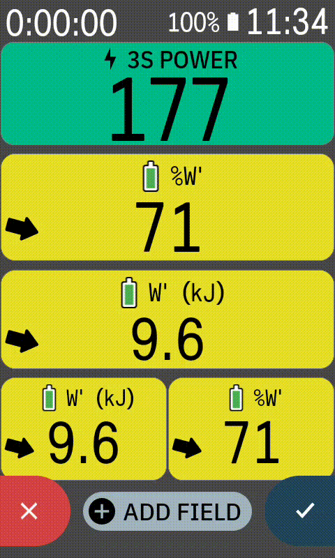
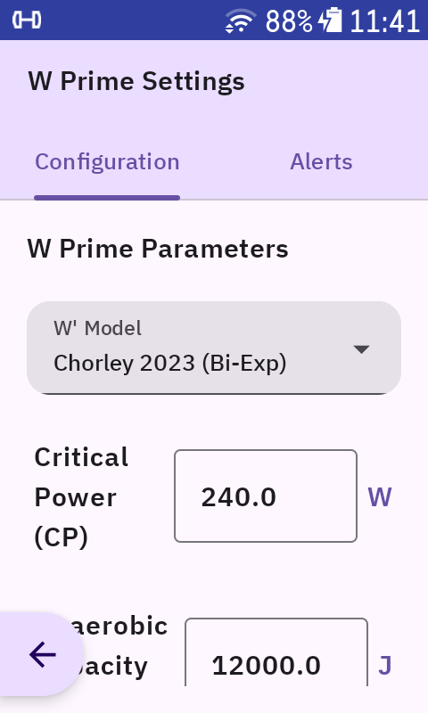
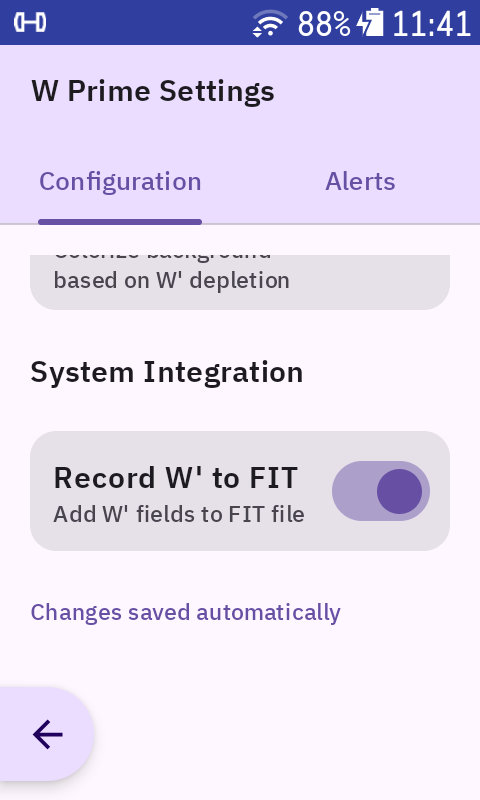
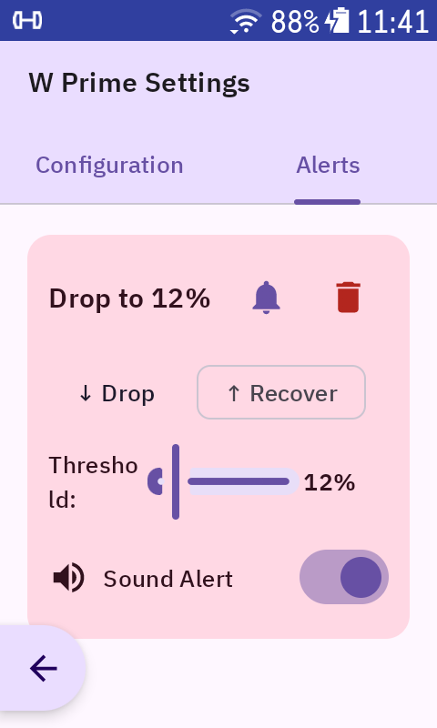
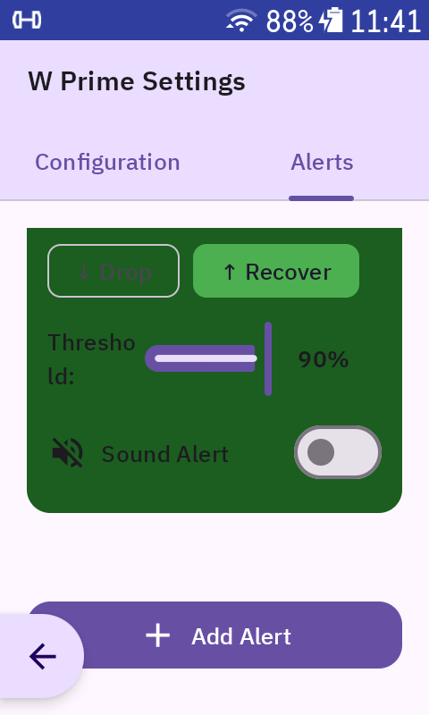
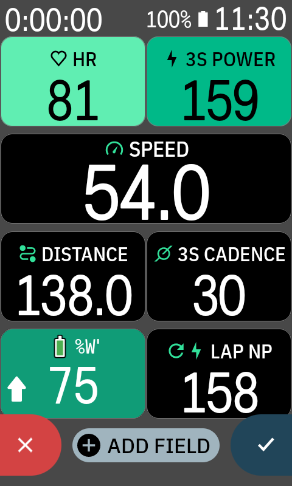
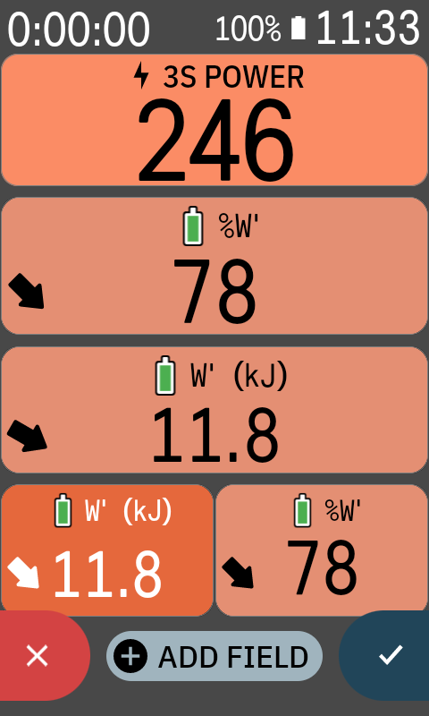
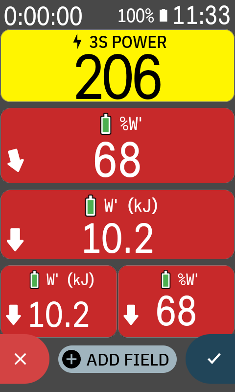
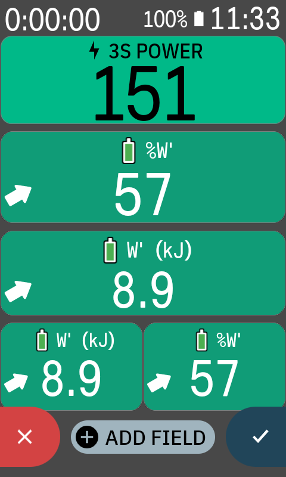
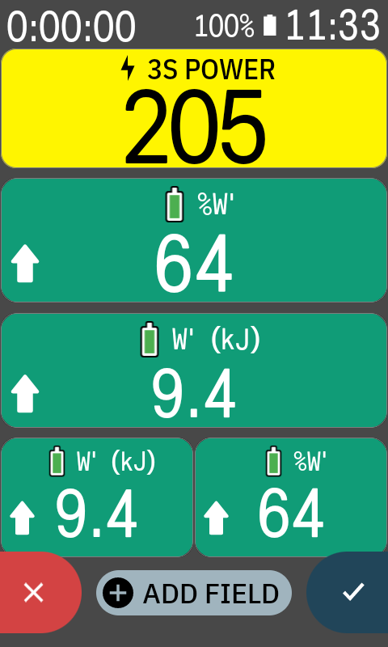

# W Prime Extension for Hammerhead Karoo 3

[](https://github.com/apopovsky/WPrimeKarooExtension/actions/workflows/ci.yml)
[](LICENSE)
[](https://www.hammerhead.io/)

Real-time W' / W Prime balance tracking for the Hammerhead Karoo 3.

W' is your finite anaerobic energy reserve: it depletes when you ride above Critical Power and replenishes when you ease off. This extension adds that balance to Karoo ride pages so you can pace climbs, attacks, intervals, and repeated hard efforts without guessing how much is left in the tank.

<p align="center">
  
</p>

## Features

- Real-time W' balance during rides
- Two graphical data fields:
  - **W Prime (%)** for 0-100% remaining
  - **W Prime (kJ)** for absolute energy
- Six selectable W' models, with **Skiba Differential (2014)** as the default
- Configurable Critical Power, W' capacity, tau recovery, and kIn
- Manual Critical Power or Karoo profile FTP × 0.95, with manual fallback if FTP is unavailable
- Optional trend arrow and power-ratio color coding
- Configurable in-ride threshold alerts for W' drop and replenishment
- FIT developer fields for post-ride analysis:
  - `WPrimeJ`
  - `WPrimePct`
- Settings hot-reload while the extension is running
- Free and open source

## Requirements

- Hammerhead Karoo 3
- Power meter connected to the Karoo
- Karoo firmware with sideloading support; the declared karoo-ext 1.1.9 release specifies KOS 1.634.2440 or later ([official release](https://github.com/hammerheadnav/karoo-ext/releases/tag/1.1.9))
- Hammerhead Companion App for the easiest install path, or ADB for manual install

## Install

Download the latest APK from:

https://github.com/apopovsky/WPrimeKarooExtension/releases/latest

### Companion App

1. Open the release page on your phone.
2. Long-press or share the APK download link.
3. Select **Hammerhead Companion App**.
4. Wait for the transfer to the Karoo.
5. Tap **Install** on the Karoo when prompted.

For details, see Hammerhead's sideloading guide:

https://support.hammerhead.io/hc/en-us/articles/31576497036827-Companion-App-Sideloading

### ADB

```bash
adb install WPrimeExtension-vX.X.X.apk
```

## Setup

1. Open the **W Prime** app from the Karoo app drawer.
2. Set your physiological values:
   - **Critical Power (CP)**: enter a measured value manually, or enable the Karoo FTP source (FTP × 0.95). This factor is an application heuristic; unavailable FTP falls back to the stored manual value.
   - **W' capacity**: start around 12,000-20,000 J if you do not know your measured value.
   - **Model**: start with **Skiba Differential (2014)**.
3. Optional: enable/disable FIT recording, trend arrow, colors, and alerts.
4. Add one or both data fields to a ride profile:
   - **W Prime (%)**
   - **W Prime (kJ)**

During a ride:

- **100%** means your modeled W' is full.
- **50%** means about half remains.
- **0%** means the model considers W' depleted. Back off and let it recover.

## Screenshots

### Configuration

<p align="center">
  
  &nbsp;&nbsp;&nbsp;
  
</p>

<p align="center">
  
  &nbsp;&nbsp;&nbsp;
  
</p>

### Ride Fields

<p align="center">
  
  &nbsp;&nbsp;&nbsp;
  
</p>

<p align="center">
  
  &nbsp;&nbsp;&nbsp;
  
  &nbsp;&nbsp;&nbsp;
  
</p>

## Choosing a Model

**Skiba Differential (2014)** is the default. The six choices below name the current implementations; they have not been scientifically certified by this project. Several implementations have known discrepancies documented in the technical audit.

| Model | Implementation status | Notes |
| --- | --- | --- |
| Skiba Differential (2014) | Default | Differential update with bounded balance |
| Skiba 2012 Monoexponential | Needs correction | Currently uses differential recovery; documented tau is not applied |
| Bartram 2018 | Needs validation | App uses configured tau rather than the formula fallback |
| Caen/Lievens Domain | Needs validation | Hardcoded domain recovery constants |
| Chorley 2023 Bi-Exponential | Simplified | Repartitions the deficit at each update; results depend on update cadence |
| Weigend 2022 Hydraulic | Simplified | Configurable kIn inflow |

For formulas and implementation notes, see [docs/wprime-algorithms.md](docs/wprime-algorithms.md).

## FIT Recording

FIT recording is enabled by default and writes W' balance into developer fields:

- `WPrimeJ`: W' balance in Joules
- `WPrimePct`: W' balance as a percentage

These fields can be used by tools that support FIT developer fields, such as WKO5, Golden Cheetah, and Intervals.icu. Disable this from the W Prime settings screen if you do not want custom FIT fields.

## Alerts

You can configure alerts from the **Alerts** tab in the W Prime app.

- **Drop** alerts fire when W' falls through a threshold.
- **Replenish** alerts fire when W' recovers through a threshold.
- Sound can be enabled per alert.
- Alerts use Karoo in-ride alerts, so they appear on the ride screen.

## Troubleshooting

### Power is unavailable

- Make sure a power meter is connected. Explicit sensor loss holds the balance and hides the trend arrow while recording.
- Open the W Prime app and confirm CP and W' are configured.
- Confirm the extension is enabled in Karoo settings.

### Values feel wrong

- Re-check Critical Power. A common starting point is FTP x 0.95.
- Re-check W' capacity. Many riders land somewhere around 10-25 kJ.
- Use the default Skiba Differential while checking settings and the known model limitations below.

### The extension does not appear after install

- Reboot the Karoo.
- If using ADB, inspect logs with:

```bash
adb logcat | grep WPrime
```

## Build from Source

```bash
./gradlew :app:assembleDebug spotlessCheck
./gradlew :app:installDebug
./gradlew :shared:testDebugUnitTest :simulator:testDebugUnitTest :app:lintDebug :simulator:lintDebug
```

See [CONTRIBUTING.md](CONTRIBUTING.md#development-setup) for SDK/JDK and GitHub Packages authentication. Deterministic tests cover the engine, settings persistence and debug replay parser.

Debug APK output:

```text
app/build/outputs/apk/debug/WPrimeExtension-v<version>-debug.apk
```

## Technical Notes

- Kotlin Android app using MVVM, Hilt, Jetpack Compose, Glance, DataStore, and karoo-ext.
- The extension registers two graphical data fields via `extension_info.xml`.
- One serialized ride runtime owns raw-power integration; both fields, alerts and FIT consume its immutable snapshot.
- Cosmetic settings preserve W′. CP, capacity or model changes preserve the remaining fraction and start a new integration interval.
- Pauses recover at 0 W; explicit sensor loss holds balance until reconnection. Silent streams begin zero-power recovery after more than five seconds.
- Alerts work independently of visible fields. Rendering filters unchanged presentation and limits graphical updates to 1 Hz.
- A separate simulator application uses the shared Glance field, settings UI and production engine; it is never included in the Karoo APK.

See [CONTRIBUTING.md](CONTRIBUTING.md#prioritized-improvement-plan) for completed work and remaining scientific, dependency, host and battery validation. Battery savings have not yet been measured on Karoo.

## Local simulator without a Karoo

Create an Android Virtual Device in Android Studio, then run on Windows:

```powershell
.\scripts\start-simulator.ps1
```

The default AVD is `Medium_Phone_API_35`; pass `-Avd <name>` or `-Serial emulator-5554` for another emulator. The script builds and installs only on an emulator. Use `-SkipBuild` to reopen an existing debug APK.

Choose **Full-width row**, **Half-row** or **Full-screen**, and percent or kJ. **Settings** opens the real app configuration: change CP or algorithm there and return to the lab. Use **Start**, **Pause ride**, **Reset** and power buttons **+1 / +10 / −1 / −10 / 0 / CP**. Pause continues zero-power recovery; **Freeze clock** stops virtual time. Speeds and CSV scenarios allow repeatable long efforts and sensor loss.

This renders real Glance RemoteViews; it does not emulate Karoo firmware, host services, audible alerts or FIT-file generation. Those and battery usage still need final device checks. The laboratory has a separate package, configuration store and APK; its guarded launcher only installs on emulators.
Modules: `app` contains the Karoo extension/runtime; `shared` contains the engine, settings and UI; `simulator` contains the laboratory and replay controls.

## What's new in 1.2.0

One shared ride calculation powers both fields, alerts and FIT. This version adds optional Karoo FTP-derived CP, validated settings with visible save errors, sensor-loss handling, bounded graphical updates and release shrinking.

The standalone emulator laboratory renders the actual fields and settings UI and is excluded from the Karoo APK. Requires KOS 1.634.2440 or later.

Production releases are built and signed through GitHub Actions. Install updates through the Hammerhead Companion App or ADB.

Version 1.2.0 introduces a permanent release signing identity. Upgrading from 1.1.x requires a one-time reinstall: note your settings first. Subsequent releases use the same key and support normal updates.

## Contributing

Contributions are welcome. Useful areas include:

- Algorithm improvements
- UI readability on different Karoo layouts
- Real-world ride testing
- Documentation improvements
- Translations

Before opening a pull request, please test on Karoo hardware when the change affects ride behavior or the Glance data field UI.

## Support

- Issues: https://github.com/apopovsky/WPrimeKarooExtension/issues
- Discussions: https://github.com/apopovsky/WPrimeKarooExtension/discussions
- Karoo community: https://reddit.com/r/Karoo
- Hammerhead extensions forum: https://support.hammerhead.io/hc/en-us/community/topics/31298804001435-Hammerhead-Extensions-Developers

When reporting a bug, please include Karoo firmware version, extension version, CP/W' values, selected model, expected behavior, observed behavior, and logcat output if available.

## License

Apache License 2.0. See [LICENSE](LICENSE).

## Disclaimer

This extension is provided for training and educational use. W' balance is model-based and may not perfectly represent individual physiology. Always ride safely and use your own judgment.
